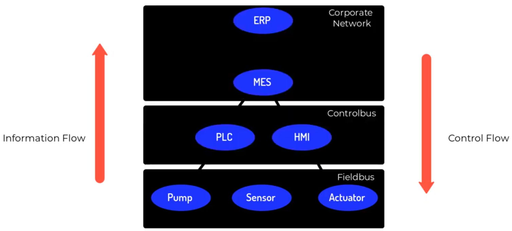
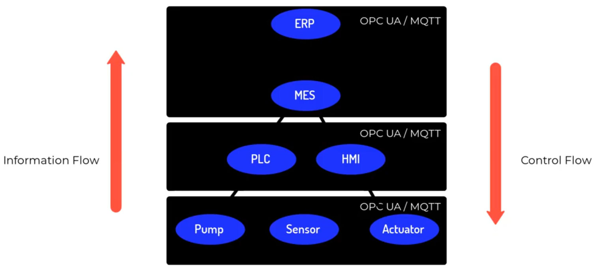
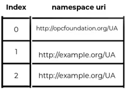
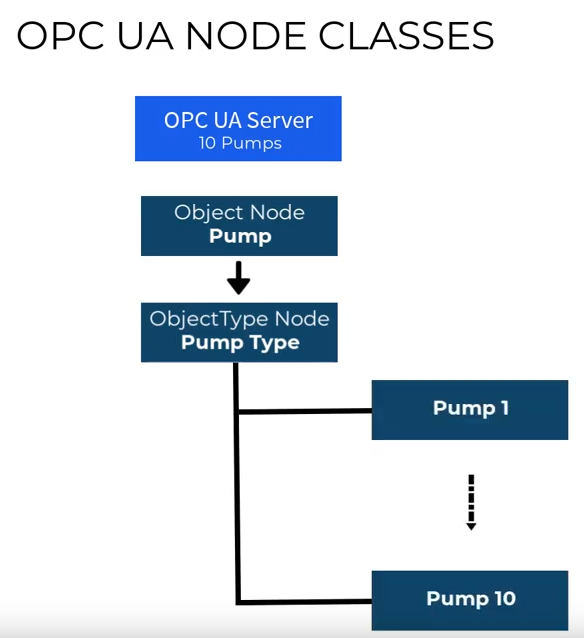

# OPC UA - Hello World

- [Introduction](#introduction)
- [History](#history)
- [Automation Piramide](#automation-piramide)
- [Information Model](#opc-ua---information-model)
  - [Base Information Model](#opc-ua---base-information-model)
  - [Built-in Information Models](#opc-ua-built-in-information-models)

## Introduction

**OPC Unified Architecture (OPC UA)** is a cross-platform, open-source, IEC62541 standard for data exchange from sensors to cloud applications developed by the [OPC Foundation](https://opcfoundation.org/). Distinguishing characteristics are:

- Standardized data models freely available for over 60 types of industrial equipment, published by the OPC Foundation via Companion Specifications

- Extensible security profiles, including authentication, authorization, encryption and checksums

- Extensible security key management, including X.509, token and password

- Support for both client-server and publish-subscribe communication patterns

- Communication protocol independent. Mappings to several communication protocols like TCP/IP, UDP/IP, WebSockets, AMQP and MQTT are specified

- Initially successful in standardized data exchange with industrial equipment (discrete manufacturing, process manufacturing, energy) and systems for data collection and control, but now also leveraged in building automation, weighing and kitchen equipment and cloud applications

- Open – open-source reference implementations freely available to [OPC Foundation](https://opcfoundation.org/) members, non members under GPL 2.0 license

- Cross-platform – not tied to one operating system or programming language

- Service-oriented architecture (SOA)

- The specification is freely available on the OPC Foundation website and is split into several parts to ease implementation, but only OPC UA stack vendors need to read them, end users simply leverage existing commercial and/or open-source stacks available in all popular programming languages

## History

Although developed by the same organization, OPC UA differs significantly from its predecessor, Open Platform Communications (OPC). The Foundation's goal for OPC UA was to provide a path forward from the original OPC communications model (namely the Microsoft Windows-only process exchange COM/DCOM) that would better meet the emerging needs of industrial automation.

After more than three years of specification work and another year for a prototype implementation, the first version of the Unified Architecture was released in 2006.

The current version of the specification is on 1.04 (22 November 2017). The new version of OPC UA now has added publish/subscribe in addition to the client/server communications infrastructure.

Although the original binding to COM/DCOM helped OPC to distribute well, it had several drawbacks:

Frequent configuration issues with DCOM:

- No configurable time-outs;
- Microsoft Windows only;
- Lower security;
- No control over DCOM (COM/DCOM is kind of a black box, developers have no access to sources and therefore have to deal with bugs or insufficient implementations).

These drawbacks along with a number of other considerations pushed the decision to develop a new and independent stack for OPC UA, which replaces COM/DCOM. The main characteristics of this communication stack were:

- Multi-platform implementation, including portable ANSI C, Java and .NET implementations;
- Scalability: from smart sensors and smart actuators to mainframes;
- Multi-threaded, as well as single-threaded/single-task operation—necessary for porting the stack to embedded devices;
- Security, based on new standards;
- Configurable time-outs for each service;
- Chunking of big datagrams.

This communication stack reflects the beginning of various innovations. The OPC UA architecture is a service-oriented architecture (SOA) and is based on different logical levels.

OPC Base Services are abstract method descriptions, which are protocol independent and provide the basis for OPC UA functionality. The transport layer puts these methods into a protocol, which means it serializes/deserializes the data and transmits it over the network. Two protocols are specified for this purpose. One is a binary TCP protocol, optimized for high performance and the second is Web service-oriented.

The **OPC information model** is a Mesh Network based on **nodes**. These nodes can include any kind of meta information, and are similar to the objects of object-oriented programming (OOP). **A node can have attributes for read access (DA, HDA)**, **methods that can be called (Commands)**, and **triggered events that can be transmitted (AE, DataAccess, DataChange)**. Nodes hold process data as well all other types of metadata. The OPC namespace contains the type model.

Client software can verify what profiles a server supports. This is necessary to obtain information, if a server only supports DA functionality or additionally AE, HDA, etc. Additionally, information can be obtained about whether a server supports a given profile. New and important features of OPC UA are:

- Redundancy support
- Heartbeat for connections in both directions (to indicate whether the other end is "alive"). This means that both server and client recognize interrupts.
- Buffering of data and acknowledgements of transmitted data. Lost connections don't lead to lost data anymore. Lost datagrams can be refetched.

At the OPC UA DevCon in October 2006, in Munich the first prototypes were presented live. Various UA Servers have been shown on a Beckhoff programmable logic controller and an embedded test board from Euros. The Beckhoff PLC is based on Windows XP Embedded and the embedded controller is based on the real-time operating system Euros. The company Embedded Labs Ltd demonstrated an OPC UA Server based on their own C++ UA Stack executing on a single chip ARM microcontroller with 64kB RAM. In October 2012 the German Fraunhofer-Application Center IOSB-INA and the Institute for industrial Information Technologies (inIT) showed that an OPC UA server is scalable down to 15 kB RAM and 10 kB ROM and therefore usable at chip level.

## Automation Piramide

  

  

## OPC UA - Information Model

When we use OPC UA the best practice to modeling our datas is to represent our fields/equipments/collected datas in a hierarchical way for all OPC UA data.

The OPC UA data modeling was built in top of OOP, so there is a lot of basic Data Types and Built-in Data Types which we inherited to create our own Data Types. Each Data Type has its own **identifier**. Identifier kind of UUID for each Data Type and is composed by tree elements: *namespace uri*, *identifier data type* and *identifier*. Exemplo:

> ns=http://opcfundation.org/UA/;string=Temperature

In this exemplo the ns is *http://opcfundation.org/UA/*, the data type is *string* and the identifier is *Temperature*.

As we can see this identifier is a lite bit longer, and it is because the namespace is too long. In the OPC UA we store all the namespace in something like a table

  

And we can use this table to improve our Identifier so now our ID could be:

> ns=0;string=Temperature

The basic unit in a OPC UA is called Node, the node has: Name, Data, References (References to other nodes).

The basic data types offering by the OPC UA is called Class and we use this class to create our Nodes.

- **Variable Node Class**: Used to transport data
- **Method Node Class**: Used to expose rpc methods
- **Object Node Class**: Used to create real world objects. We can store state and behavior, we store through Variable Node and behavior through Method Node.
- **Object Type Node Class**: Used to define Node Types like an **struct**, Exemplo we can create a Pump Type and use it to represent our Pump 1, Pump 2 and so on.
- **Reference Type Node Class**: Used to reference an Class to another. As we now we can create our types uniting all the other class and we use this class to reference one to another.

The picture bellow show an exemplo how we can use those class

  

 ### OPC UA - Base Information Model

#### OPC UA Built-in Information Models

- **DA - Data Access**
  - Read
  - Write
  - Browse
  - Subscribe

- **HA - Historical Access**
  - Processing Collected Data
  - Analyzing Collected Data

- **AC - Alarms And Conditions**
  - Receive Alarms
  - Filter Alarms

- **Prog - Program Information Model**
  - Run Stored Instructions